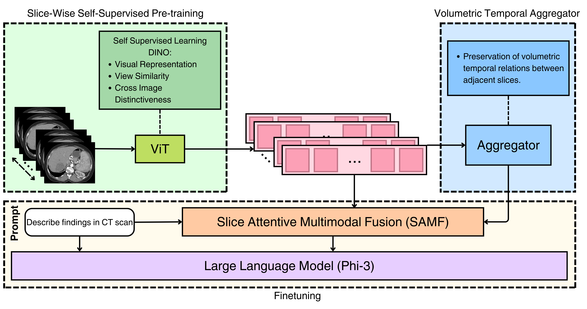

# [MICCAI' 25] From Slices to Volumes: Multi-Scale Fusion of 2D and 3D Features for CT Scan Report Generation

This is an official implementation of **[MICCAI 2025]** - From Slices to Volumes: Multi-Scale Fusion of 2D and 3D Features for CT Scan Report Generation

## Project overview
 <p align="center">
  
 </p>

A methodology that utilize both the high-level spatial features of 3D data and the rich local details of 2D slices. Our approach begins by pretraining a 2D encoder using a self-supervised learning framework on CT scan slices from three planes: axial, coronal, and sagittal. The outputs of this 2D encoder are then processed by a 3D aggregator to preserve volumetric temporal relationships between slices. Additionally, we introduce a novel fusion technique, Slice-Attentive Multimodal Fusion (SAMF), designed to seamlessly combine 2D and 3D features, enabling richer and more contextually aware representations, see figure below. This fused representation is then fed into an LLM to generate medical reports.

 <p align="center">
  
 </p>

## Installation

Set up the environment as follows:

```sh
git clone https://github.com/serag-ai/SAMF.git
cd SAMF
conda create -n samf python=3.10
conda activate samf
pip install -r requirements.txt
```

## Pretraining Image Encoder

To pretrain the slice-based image encoder, run:

```sh
python3 -u src/dino/dino.py --epochs 500 \
                            --output_dir PATH_TO_OUTPUT_DIR \
                            --batch_size 32
```

Replace `PATH_TO_OUTPUT_DIR` with your desired output directory.

## Finetuning

To fine-tune the model, run the following script:

```sh
sh script/finetune_phi3.sh
```

Ensure you have set the dataset directory and related file paths in your bash script before running the script. Refer to `script/finetune_phi3.sh` for detailed configuration.

## Merge

After finetuning, you need to merge LoRA weights with the original weights. Follow :

**Run the Merge Script** 🔄:
   ```sh
   python3 -u merge_lora_weights_and_save_hf_model.py \
   --model_type phi3 \
   --model_with_lora PATH_TO_FINETUNED_MODEL \
   --mm_fuse_type samf \
   --output_dir PATH_TO_OUTPUT_DIR/
   ```

## Evaluation

To perform evaluation using provided metrics, follow :

**Run the vlm/eval/eval_caption.py Script** 🔄:
   ```sh
    python3 -u /src/vlm/eval/eval_caption.py \
    --model_name_or_path PATH_TO_MERGED_MODEL/ \
    --output_dir PATH_TO_OUTPUT_DIR
   ```

## Dataset

Download the [CT-Rate](https://huggingface.co/datasets/ibrahimhamamci/CT-RATE) dataset. For this work, we have converted the data into CSV files.

The format for training medical report generation is:

| **image**   | **caption** |
|-------------|-------------|
| image_path  | text        |

For visual-question answering (VQA), the CSV header is as follows:

| **Question ID** | **Image** | **Question** | **Choice A** | **Choice B** | **Choice C** | **Choice D** | **Answer Choice** | **Answer** |
|-----------------|-----------|--------------|--------------|--------------|--------------|--------------|-------------------|------------|
| ...             | ...       | ...          | ...          | ...          | ...          | ...          | ...               | ...        |

## Acknowledgement
We appreciate open source projects including: 
[LLaVA](https://github.com/haotian-liu/LLaVA) and 
[M3d](https://github.com/BAAI-DCAI/M3D), 